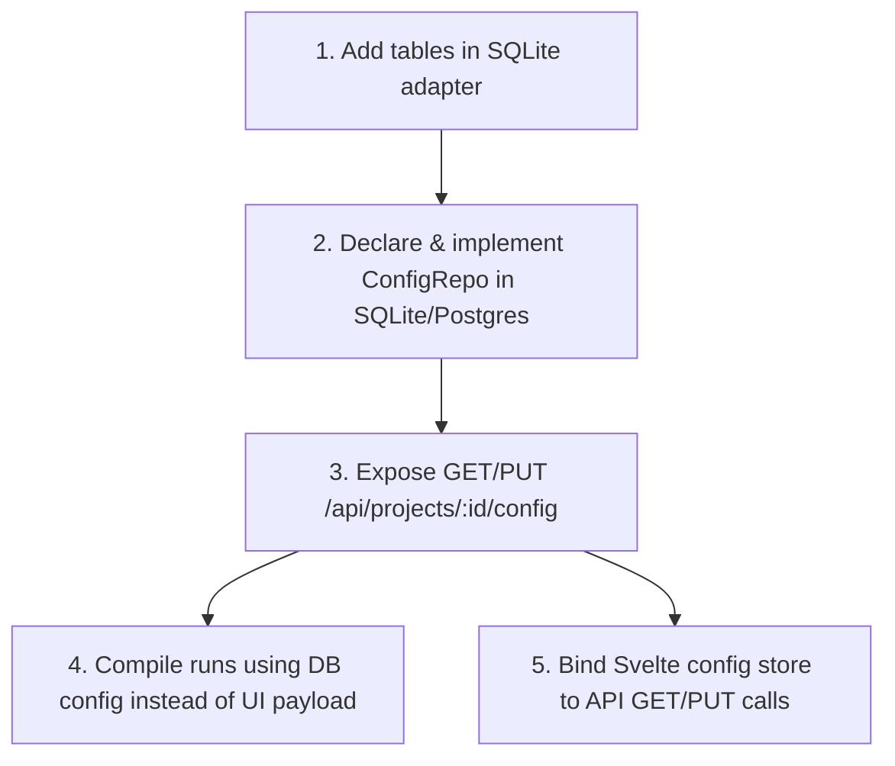

# Config Persistence Blockers and Refactoring Plan

> [!summary]
> This note outlines the technical blockers preventing Smokery from persisting environment, authentication, flow, and suite configurations outside browser-local storage. It maps out a detailed implementation plan across the DB schema, Go repository ports, adapter implementations, HTTP delivery endpoints, and the Svelte frontend.

---

## 1. Identified Technical Blockers

Currently, the configuration plane is local-first only because:
1. **No CRUD endpoints:** There are no backend HTTP endpoints to list, retrieve, create, update, or delete flows, suites, environments, or auth profiles.
2. **Repository ports missing:** The domain/application port interfaces (`apps/core/internal/port/repo.go`) do not declare methods for loading or saving config entities.
3. **SQLite schema gaps:** The SQLite local database schema (`apps/core/internal/adapter/sqlite/sqlite.go`) lacks tables for `environments`, `auth_profiles`, `flows`, and `suites`.
4. **Postgres adapter gaps:** Postgres has tables defined via migrations, but lacks repository query implementations.
5. **Frontend/Backend decoupling:** The frontend is solely responsible for storing configurations in browser `localStorage` and passing them dynamically in preview/run payloads, violating the compiler-first control plane rule.

---

## 2. Detailed Refactoring Plan

We will address these blockers sequentially across three layers: database, backend, and frontend.

### Step 1: Database Schema Alignment (SQLite)
* **Target File:** [sqlite.go](file:///home/fanboykun/dev/personal/smokery/apps/core/internal/adapter/sqlite/sqlite.go)
* **Changes:** Add initialization schemas for the missing configuration tables:
```sql
CREATE TABLE IF NOT EXISTS environments (
    id TEXT PRIMARY KEY,
    project_id TEXT NOT NULL REFERENCES projects(id) ON DELETE CASCADE,
    name TEXT NOT NULL,
    base_url TEXT NOT NULL,
    headers TEXT NOT NULL DEFAULT '{}'
);

CREATE TABLE IF NOT EXISTS auth_profiles (
    id TEXT PRIMARY KEY,
    project_id TEXT NOT NULL REFERENCES projects(id) ON DELETE CASCADE,
    name TEXT NOT NULL,
    type TEXT NOT NULL,
    config TEXT NOT NULL DEFAULT '{}'
);

CREATE TABLE IF NOT EXISTS flows (
    id TEXT PRIMARY KEY,
    project_id TEXT NOT NULL REFERENCES projects(id) ON DELETE CASCADE,
    name TEXT NOT NULL,
    description TEXT NOT NULL DEFAULT '',
    config TEXT NOT NULL DEFAULT '{}'
);

CREATE TABLE IF NOT EXISTS suites (
    id TEXT PRIMARY KEY,
    project_id TEXT NOT NULL REFERENCES projects(id) ON DELETE CASCADE,
    name TEXT NOT NULL,
    description TEXT NOT NULL DEFAULT '',
    config TEXT NOT NULL DEFAULT '{}'
);
```

### Step 2: Unified Config Repository Port & Adapters
Rather than creating 4 separate repositories, we will introduce a unified config management interface on the project level to load/save the full `ProjectConfig` document (matching the model struct).
* **Port File:** [repo.go](file:///home/fanboykun/dev/personal/smokery/apps/core/internal/port/repo.go)
* **New Port:**
```go
type ConfigRepo interface {
	GetProjectConfig(ctx context.Context, projectID uuid.UUID) (*model.ProjectConfig, error)
	SaveProjectConfig(ctx context.Context, projectID uuid.UUID, cfg model.ProjectConfig) error
}
```
* **Adapter Implementations:** Implement `ConfigRepo` in:
  - [sqlite.go](file:///home/fanboykun/dev/personal/smokery/apps/core/internal/adapter/sqlite/sqlite.go)
  - A new file `apps/core/internal/adapter/postgres/config_repo.go`

### Step 3: HTTP Delivery Endpoints
* **Target File:** Create `apps/core/internal/delivery/http/config.go`
* **Endpoints:**
  - `GET /api/projects/{project-id}/config` -> Returns the full configuration.
  - `PUT /api/projects/{project-id}/config` -> Replaces the full configuration.
* **Refactor compiler triggers:**
  - Modify `POST /api/projects/{project-id}/runs` so that the frontend does not have to send the compiled `SmokePlan`. The runner should fetch the configuration from the database, compile it on the backend, validate it, and execute it.

### Step 4: Frontend State Integration
* **Target File:** [project-config.ts](file:///home/fanboykun/dev/personal/smokery/apps/web/src/lib/stores/project-config.ts)
* **Changes:**
  - Refactor `createProjectConfigStore` to load state from the backend `/api/projects/{id}/config` endpoint via `openapi-fetch`.
  - Save to the backend with debounce/autosave or a manual Save button.

---

## 3. High-Level Dependency Graph


