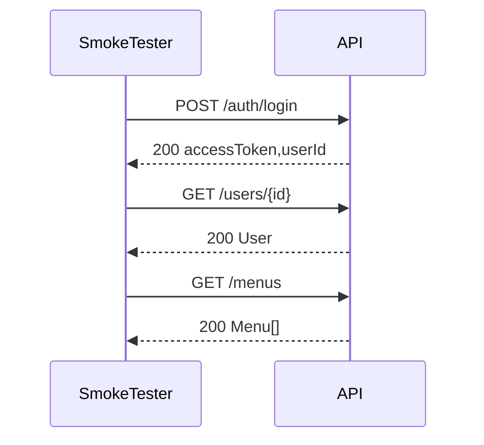

````markdown
# OpenAPI-Driven Smoke Testing Platform — Concept Design Document

Status: Concept Draft  
Audience: Backend Developers, Frontend Developers, Analysts, QA, DevOps, Product/Engineering Leads, AI Agents  
Purpose: Define the product concept, core smoke-testing model, pre-smoke configuration lifecycle, execution model, and post-smoke output/reporting vision.

---

## 1. Executive Summary

This product is a **collaborative smoke-testing platform** powered by an **OpenAPI-aware configuration compiler**.

It is not just a CLI tool that runs HTTP checks.

The core idea is:

```text
OpenAPI Spec + User-Composed Smoke Configuration
        ↓
Compiler / Composer
        ↓
Executable Smoke Plan
        ↓
Runner / Agent / CLI
        ↓
Persistent Run Result
        ↓
Reports, Diagrams, Debug Views, Collaboration, Insights
````

The platform helps teams:

* Understand API surface from OpenAPI.
* Compose smoke tests visually through UI.
* Generate broad smoke coverage safely.
* Define explicit business/API flows.
* Run smoke tests against environments.
* Persist results as collaborative artifacts.
* Produce reports useful for backend, frontend, QA, analysts, and operations.
* Trace failures back to server logs using request IDs or trace IDs.
* Generate flow diagrams and runtime API behavior documentation.

The core selling feature is:

> A collaborative smoke-testing platform that turns OpenAPI-driven smoke runs into living API flow documentation, runtime evidence, and actionable debugging insight.

---

## 2. Product Framing

The product should be designed as a **full smoke-testing management platform**, not merely a CLI application.

The CLI or runner may exist, but it is not the primary user experience.

The main product experience is:

```text
User creates smoke project in UI
        ↓
Imports or syncs OpenAPI spec
        ↓
System analyzes API operations
        ↓
User composes environments, auth, suites, flows, fixtures, and policies via UI
        ↓
System compiles a smoke plan
        ↓
User previews and runs the plan
        ↓
System stores run result persistently
        ↓
Different teams consume the result through different report views
```

The runner can be implemented as:

* Cloud runner
* Self-hosted/private-network runner
* CLI runner
* CI runner
* Scheduled agent

But the platform value comes from the UI-managed configuration lifecycle and persistent collaboration model.

---

## 3. Product Architecture Concept

The platform should be split into two conceptual planes.

### 3.1 Control Plane

The control plane manages projects, configuration, collaboration, and historical data.

Responsibilities:

* Project management
* OpenAPI spec ingestion
* Spec versioning
* Operation discovery and classification
* Environment configuration
* Auth profile configuration
* Suite builder
* Flow builder
* Fixture management
* Compiler validation
* Plan preview
* Run orchestration
* Report generation
* Run history
* Comments and collaboration
* Failure classification
* Trace/log integration settings

### 3.2 Execution Plane

The execution plane performs the actual smoke test execution.

Responsibilities:

* Execute compiled smoke plans
* Compose HTTP requests
* Inject auth
* Resolve variables
* Execute flows and suites
* Capture response values
* Validate assertions
* Validate response schemas
* Extract request IDs and trace IDs
* Return structured run results

The execution plane can be implemented as:

```text
Cloud runner
Private runner
CLI runner
CI runner
Scheduled runner
```

The important rule:

> The UI should not directly run arbitrary form state. The UI produces canonical configuration, the compiler produces an executable plan, and the runner executes only the compiled plan.

---

## 4. Core Mental Model

The smoke tester should be understood as:

```text
Smoke tester = OpenAPI-driven compiler + composable flow/suite runner
```

The platform has two first-class execution shapes:

```text
Flow
  Explicit, ordered, scenario-driven.

Suite
  Selected, generated, operation-driven.
```

### 4.1 Flow

A flow is a manually composed, ordered smoke scenario.

Example:

```text
login
  ↓
create user
  ↓
get user
  ↓
update user
  ↓
delete user cleanup
```

Flows are useful for:

* Critical app journeys
* Login/auth flow
* CRUD lifecycle verification
* Business process sanity checks
* Frontend integration understanding
* Analyst flow verification

### 4.2 Suite

A suite is generated from operation selection rules.

Example:

```text
Select all list-like GET endpoints
Generate default list checks
Generate pagination checks
Generate search checks
Generate enum filter checks
Run them concurrently
Report per endpoint and generated case
```

Suites are useful for:

* Broad API coverage
* List endpoint health
* Read-only endpoint validation
* Environment sanity
* Schema drift detection
* API surface smoke testing

---

## 5. Key Entities

The platform should preserve these key concepts.

### 5.1 Spec

The OpenAPI document.

It describes possible API interactions:

* Paths
* Methods
* Parameters
* Request bodies
* Response schemas
* Security schemes
* Tags
* Operation IDs
* Examples

OpenAPI is the API contract source, but it is not always enough to run meaningful smoke tests.

### 5.2 Operation

An API capability discovered from OpenAPI.

Example:

```text
GET /users
POST /users
GET /users/{id}
DELETE /users/{id}
```

### 5.3 Operation Registry

A normalized internal registry of operations.

The registry should support operation aliases, classification, metadata, and user overrides.

Example:

```yaml
operations:
  listUsers:
    operationId: listUsers
    method: GET
    path: /users
    kind: list
    destructive: false

  createUser:
    operationId: createUser
    method: POST
    path: /users
    kind: create
    destructive: true
```

### 5.4 Operation Map

A local mapping between human-friendly operation aliases and OpenAPI operations.

This helps avoid directly referencing fragile OpenAPI details everywhere.

### 5.5 Flow

An explicit ordered test journey.

A flow contains steps.

### 5.6 Step

One operation invocation inside a flow.

A step contains:

* Operation reference
* Request config
* Expected result
* Capture rules
* Dependency rules
* Cleanup flag
* Destructive flag

### 5.7 Suite

A group of generated operation tests.

A suite contains:

* Operation selectors
* Execution settings
* Strategy configuration
* Sanity checks
* Report settings

### 5.8 Operation Group

In a suite, each selected operation becomes an operation group.

Example:

```text
GET /users
  - default list case
  - pagination case
  - search-from-response case
  - enum filter case
```

### 5.9 Generated Case

A generated executable test case inside a suite operation group.

### 5.10 Request

The actual request generated from:

* Environment config
* Auth config
* Flow/suite config
* Step/case config
* Fixtures
* Captured values
* OpenAPI examples
* OpenAPI schema
* Built-in generated values

### 5.11 Capture Store

A runtime store for values extracted from previous responses.

Example:

```yaml
capture:
  userId: $.data.id
  accessToken: $.data.accessToken
```

Later steps can use:

```text
${steps.login.accessToken}
${steps.create_user.userId}
```

### 5.12 Expectation

Defines what success means.

Examples:

* Expected HTTP status
* Response schema validation
* Header assertion
* Body assertion
* Latency threshold
* List sanity check
* Pagination sanity check

### 5.13 Plan

The compiled executable representation of flows and suites.

The runner should execute the plan, not raw UI configuration.

### 5.14 Run

An actual execution of a compiled plan.

### 5.15 Report

A human-readable or machine-readable interpretation of a run result.

Reports can be tailored for different audiences.

---

## 6. Core Design Principles

The platform should preserve these principles.

### 6.1 Flow-First, Not Endpoint-List-First

Smoke tests should verify meaningful API behavior, not randomly hit endpoints.

Explicit flows are required for important app journeys.

### 6.2 OpenAPI Describes Possibilities; Config Selects Intent

OpenAPI tells the platform what exists.

User-composed configuration tells the platform what should be tested, how, and why.

### 6.3 Treat Plan Generation Like a Compiler Pipeline

The system should compile configuration into an executable plan before running.

It should validate early.

Bad configuration should fail before execution.

### 6.4 Prefer Explicit Config Over Magic

The platform may infer and suggest, but users must be able to override.

This is especially important for:

* Operation classification
* Destructive operation safety
* Response shape detection
* Pagination parameters
* Search fields
* Empty result policy
* Auth behavior

### 6.5 Use OpenAPI Examples and Schemas as Helpers, Not Absolute Truth

OpenAPI is often incomplete or inaccurate.

Request generation priority should be:

```text
1. Explicit step/case config
2. Fixtures
3. Environment variables
4. Captured values
5. OpenAPI examples
6. OpenAPI schema-generated values
7. Built-in fake values
8. Otherwise mark as needs-input
```

### 6.6 Support Capture-and-Reuse

One response must be able to feed later requests.

This is essential for flows like:

```text
create resource -> capture id -> get resource -> delete resource
```

### 6.7 Protect Destructive Operations by Default

POST, PUT, PATCH, DELETE, and business actions should not run automatically without explicit permission.

OpenAPI cannot reliably know whether something is dangerous.

### 6.8 Cleanup Is First-Class

Flows that create data should support cleanup steps.

Cleanup should run when possible, even if main steps fail.

### 6.9 Report Skipped, Blocked, and Needs-Input Clearly

The system should explain why something was not run.

Examples:

```text
Skipped: no source item found for search-from-response
Blocked: destructive operation not allowed
Needs input: required path param id has no value
```

### 6.10 Persistent and Collaborative by Default

Run output should become a shared artifact for the whole team.

The platform should support:

* Run history
* Comments
* Failure classification
* Assignees
* Links to logs/traces
* Report sharing
* Flow documentation
* Config evolution

---

## 7. Pre-Smoke Lifecycle

The pre-smoke phase is everything before execution.

It should be UI-driven, not file-first.

### 7.1 Pre-Smoke Responsibilities

```text
Import OpenAPI spec
Analyze operations
Classify operations
Detect list endpoints
Detect auth requirements
Detect parameters and request bodies
Suggest suites
Suggest draft flows
Configure environments
Configure auth
Configure fixtures
Configure suites
Configure flows
Validate configuration
Preview executable plan
```

### 7.2 Smoke Project

A smoke project is a persistent platform entity.

It should contain:

```text
Project
  Specs
  Spec versions
  Environments
  Auth profiles
  Operation registry
  Operation overrides
  Suites
  Flows
  Fixtures
  Defaults
  Report templates
  Observability integrations
  Runs
  Reports
  Comments
```

The file format may still exist for:

* Export/import
* Version control
* CI usage
* Runner input
* Backup
* Migration

But the primary product experience should be through UI.

---

## 8. OpenAPI Ingestion and Analysis

When a user imports an OpenAPI spec, the system should analyze it.

### 8.1 Analysis Output

The analyzer should identify:

```text
Total operations
Operation methods
Tags
Security requirements
List-like endpoints
Parameterized GET endpoints
Mutating operations
Dangerous-looking operations
Health/status endpoints
Report/export endpoints
Unknown operations
Required inputs
Request body examples
Response schemas
Query parameters
Enum query parameters
Pagination-like parameters
Search-like parameters
```

Example analysis summary:

```text
OpenAPI analysis result:
- 84 operations found
- 46 list-like GET operations
- 12 parameterized GET operations
- 18 mutating operations
- 8 security-sensitive operations
- 5 unknown operations need review
```

### 8.2 Operation Classification

The analyzer should classify operations into kinds:

```text
health
list
single
lookup
search
create
update
delete
action
auth
report
export
internal
unknown
```

Classification can use heuristics, but should be overrideable.

Examples:

```yaml
operations:
  searchUsers:
    operationId: searchUsers
    method: POST
    path: /users/search
    kind: list
    destructive: false

  approveOrder:
    operationId: approveOrder
    method: POST
    path: /orders/{id}/approve
    kind: action
    destructive: true

  exportOrders:
    operationId: exportOrders
    method: GET
    path: /orders/export
    kind: export
    defaultEnabled: false
```

Unknown or low-confidence classifications should be marked for review.

---

## 9. Environment Configuration

Environment configuration should be separated from smoke logic.

A flow or suite should be reusable across:

```text
local
development
staging
production
customer-specific environments
```

Environment data includes:

```text
Base URL
Environment variables
Tenant IDs
Default headers
Auth bindings
Timeout defaults
Observability links
Secret references
```

Example conceptual config:

```yaml
environment:
  name: staging
  baseUrl: https://staging-api.example.com

variables:
  tenantId: demo
  defaultPageSize: 10

secrets:
  API_TOKEN:
    fromEnv: API_TOKEN
```

---

## 10. Auth Configuration

Auth must support both static and flow-derived modes.

### 10.1 Static Auth

Example:

```yaml
auth:
  default:
    type: bearer
    token: ${secrets.API_TOKEN}
```

### 10.2 Login Flow Auth

Some APIs require login before smoke execution.

Example:

```yaml
flows:
  login_flow:
    steps:
      - id: login
        operation: login
        request:
          body:
            username: ${secrets.SMOKE_USERNAME}
            password: ${secrets.SMOKE_PASSWORD}
        capture:
          accessToken: $.access_token

auth:
  default:
    type: bearerFromFlow
    flow: login_flow
    token: ${steps.login.accessToken}
```

The auth system should support:

```text
Bearer token
API key
Cookie auth
Basic auth
OAuth-like login flow
Custom header injection
Flow-derived token
```

---

## 11. Secrets Policy

The platform should never require storing real secrets in config exports.

Secrets should be referenced through:

```text
Environment variables
Secret vault
Platform-managed encrypted secrets
Runner-local secret injection
CI secret variables
```

Redaction should be applied by default for:

```text
Authorization
Cookie
Set-Cookie
password
token
accessToken
refreshToken
apiKey
secret
```

---

## 12. Flow Configuration

A flow is an explicit scenario.

Example:

```yaml
flows:
  user_crud:
    description: Verify basic user lifecycle
    environment: staging
    auth: default
    allowDestructive: true

    steps:
      - id: create_user
        operation: createUser
        request:
          body:
            name: Smoke Test User
            email: smoke-${run.id}@example.com
        expect:
          status: 201
          schema: true
        capture:
          userId: $.id

      - id: get_user
        operation: getUser
        request:
          path:
            id: ${steps.create_user.userId}
        expect:
          status: 200
          body:
            $.id: ${steps.create_user.userId}

      - id: delete_user
        operation: deleteUser
        cleanup: true
        request:
          path:
            id: ${steps.create_user.userId}
        expect:
          status: [200, 204]
```

### 12.1 Step Capabilities

Each step should support:

```text
Operation reference
Request path params
Request query params
Request headers
Request body
Expected status
Schema validation
Body assertions
Header assertions
Latency threshold
Captures
Dependencies
Cleanup flag
Destructive flag
Run condition
```

### 12.2 Cleanup Behavior

Cleanup steps should be first-class.

If a create step succeeds but later verification fails, cleanup should still be attempted when safe.

---

## 13. Suite Configuration

A suite is selected and generated from operation rules.

Example:

```yaml
suites:
  list_sanity:
    description: Broad sanity checks for list-like endpoints

    select:
      methods: [GET]
      onlyListLike: true
      excludePathParams: true
      excludeTags:
        - Health
        - Internal
        - Metrics
      excludePaths:
        - /health
        - /version
        - /openapi.json

    execution:
      concurrency: 8
      failFast: false

    expect:
      status: 200
      schema: true
      maxLatencyMs: 1500

    sanity:
      emptyResult: warn
      requireItemObject: true
      requireIdentity: warn
      identityFields:
        - id
        - uuid
        - code
        - number

    strategies:
      defaultList:
        enabled: true

      pagination:
        enabled: true

      searchFromResponse:
        enabled: true

      enumFilters:
        enabled: true

      sorting:
        enabled: false
```

### 13.1 Operation Selector

Suites should support operation filtering by:

```text
HTTP method
Tags
Excluded tags
Path patterns
Excluded paths
Operation IDs
Excluded operation IDs
Operation kind
Has path params
Has query params
Has request body
List-like classification
Destructive flag
Internal flag
```

Example:

```yaml
select:
  methods: [GET]
  onlyListLike: true
  excludePathParams: true
  excludeTags: [Internal, Metrics]
```

---

## 14. List Endpoint Suite

List endpoints deserve first-class handling because most backend APIs contain many list/read endpoints.

They are simple, but high-value smoke surfaces.

A list suite should verify:

```text
API reachability
Auth correctness
Database availability
Serialization correctness
Response shape correctness
Pagination behavior
Search behavior
Enum filter behavior
Empty data sanity
Schema compatibility
Latency threshold
```

### 14.1 Why List Endpoints Matter

List endpoints are often used by:

* Frontend screens
* Dropdowns
* Master-data pages
* Reports
* Search pages
* Selection dialogs
* Admin panels
* Analyst workflows

A broken list endpoint may not break one isolated backend unit, but it can break large parts of an application.

### 14.2 List Suite Execution Model

A list suite should:

```text
Select list-like operations
Generate cases per operation
Run operation groups concurrently
Run dependent cases inside an operation group in order
Apply list-specific sanity checks
Persist detailed per-case results
```

Example generated group:

```text
GET /users
  - default list
  - pagination pageSize=1
  - pagination pageSize=10
  - search from response
  - enum filter status=ACTIVE
  - enum filter status=INACTIVE
```

The important insight:

> A list suite is not a business flow, but each selected endpoint can produce a generated mini-flow.

Example mini-flow:

```text
default list
  ↓
search-from-response using item from default list
```

Pagination and enum filter cases can usually run independently.

---

## 15. List Response Shape Detection

List endpoints return different response shapes.

Examples:

```json
[
  { "id": 1, "name": "A" }
]
```

```json
{
  "data": [
    { "id": 1, "name": "A" }
  ]
}
```

```json
{
  "items": [],
  "total": 0
}
```

```json
{
  "result": {
    "data": [],
    "total": 0
  }
}
```

The platform should support global and operation-level response shape config.

Example:

```yaml
responseShape:
  listPaths:
    - "$"
    - "$.data"
    - "$.items"
    - "$.results"
    - "$.rows"
    - "$.result.data"
```

Operation override:

```yaml
operations:
  listUsers:
    responseShape:
      listPath: $.data
      totalPath: $.total
      pagePath: $.page
      pageSizePath: $.pageSize
```

If no list path can be detected, the case should fail or warn depending on policy.

---

## 16. Empty Result Policy

List endpoints returning empty data may indicate a problem, but not always.

Empty result can mean:

```text
API bug
Database has no data
Tenant has no data
Filter excluded all rows
Staging environment is fresh
Permission scope is limited
```

The platform should support configurable empty result policies:

```text
allow
warn
fail
```

Example:

```yaml
sanity:
  emptyResult: warn
```

Operation-specific override:

```yaml
operations:
  listWarehouses:
    sanity:
      emptyResult: fail

  listAuditLogs:
    sanity:
      emptyResult: allow
```

Recommended default:

```text
Global default: warn
Critical master/reference endpoints: fail
Transactional endpoints: warn
Log/audit endpoints: allow or warn
```

---

## 17. Pagination Strategy

The platform should detect and test pagination parameters.

Common parameters:

```text
page
pageSize
limit
offset
perPage
take
skip
cursor
```

Generated cases:

```text
GET /orders?page=1&pageSize=1
GET /orders?page=1&pageSize=10
```

Sanity checks:

```text
Status is expected
Schema is valid
List path exists
Item count is less than or equal to requested page size
Pagination metadata is consistent if present
```

Example config:

```yaml
strategies:
  pagination:
    enabled: true
    pageParams:
      - page
    sizeParams:
      - pageSize
      - limit
      - perPage
    firstPage: 1
    pageSizes: [1, 10]
    requireLimitRespected: warn
```

If an endpoint ignores `pageSize=1`, the platform should report it clearly.

---

## 18. Search-From-Response Strategy

Search testing should be generated from real returned data.

Process:

```text
1. Run default list request
2. Extract one item
3. Pick a candidate searchable field
4. Use part of that value as search query
5. Run search request
6. Validate response shape
7. Optionally verify original item appears in result
```

Example:

```text
GET /users
-> first item: { id: 10, name: "John Smith" }

GET /users?search=John
-> response should ideally include id 10
```

Config:

```yaml
strategies:
  searchFromResponse:
    enabled: true
    searchParams:
      - search
      - q
      - keyword
    candidateFields:
      - name
      - code
      - email
      - title
      - number
    minSearchLength: 2
    expectOriginalItem: warn
```

If the default response is empty, search-from-response should be skipped with a clear reason.

---

## 19. Enum Filter Strategy

OpenAPI query params may define enums.

Example:

```yaml
parameters:
  - name: status
    in: query
    schema:
      type: string
      enum:
        - ACTIVE
        - INACTIVE
```

The platform can generate:

```text
GET /users?status=ACTIVE
GET /users?status=INACTIVE
```

Config:

```yaml
strategies:
  enumFilters:
    enabled: true
    mode: sample
    maxValuesPerParam: 2
    maxCasesPerOperation: 5
    validateFilteredItems: whenFieldMatchesParam
```

Validation modes:

```text
none
whenFieldMatchesParam
alwaysConfigured
```

If query param name matches item field name, the platform can verify returned items match the selected enum.

---

## 20. Sorting Strategy

Sorting is useful but harder to standardize.

Common params:

```text
sort
order
orderBy
sortBy
sortDir
direction
```

Sorting conventions vary widely, so deep sorting validation can be a later feature.

Initial support:

```yaml
strategies:
  sorting:
    enabled: false
    validateOrder: warn
```

Operation-specific sorting config:

```yaml
operations:
  listUsers:
    sorting:
      fields:
        - name
        - createdAt
      convention: directionPair
```

---

## 21. Execution Grouping and Concurrency

Flows are usually sequential.

Suites should support concurrency.

Execution model:

```text
Suite-level:
  Run operation groups concurrently.

Operation-group level:
  Run dependent cases in order.
  Run independent cases concurrently if safe.
```

Example:

```text
suite list_sanity, concurrency 8

GET /users group:
  default
    ↓
  search-from-response

  pagination pageSize=1
  enum status=ACTIVE

GET /orders group:
  default
    ↓
  search-from-response

  pagination pageSize=1
```

Config:

```yaml
execution:
  concurrency: 8
  caseConcurrency: 2
  failFast: false
```

Default recommendation:

```text
Run many operations concurrently.
Run cases inside the same operation mostly sequentially unless clearly independent.
```

---

## 22. Compiler Pipeline

The compiler should turn UI/canonical config into an executable plan.

Pipeline:

```text
1. Load OpenAPI spec
2. Normalize operations
3. Build operation registry
4. Apply operation overrides
5. Classify operations
6. Load project defaults
7. Load environment config
8. Resolve auth config
9. Resolve flows
10. Resolve suites
11. Generate suite cases
12. Resolve variables and fixtures
13. Validate required inputs
14. Validate auth requirements
15. Validate destructive operation rules
16. Validate response shape rules
17. Validate report/storage policies
18. Produce executable smoke plan
```

The compiler should detect errors before execution.

Examples:

```text
Step get_user requires path param id but no value was provided.
Flow user_crud contains destructive steps but allowDestructive is false.
Suite list_sanity matched zero operations.
Auth profile default references missing secret API_TOKEN.
Search-from-response enabled but no search-like query params exist.
```

---

## 23. Plan Preview

Before running, users should be able to preview the compiled plan.

Preview should show:

```text
Which flows will run
Which suites will run
Which operations were selected
How many cases were generated
Which steps are destructive
Which checks are warnings
Which operations are skipped
Which inputs are missing
What concurrency will be used
What environment will be targeted
```

Example:

```text
Plan: staging

Suites:
  list_sanity
    matched operations: 46
    generated cases: 128
    concurrency: 8

Flows:
  health_check
    steps: 1

Destructive:
  none

Skipped:
  12 parameterized GET operations need sample IDs
  8 mutating operations disabled
```

Plan preview is essential for trust.

---

## 24. Runner Responsibilities

The runner receives a compiled plan and executes it.

Runner responsibilities:

```text
Resolve runtime variables
Inject auth
Send HTTP requests
Apply timeouts
Apply retry rules if configured
Capture response values
Validate status codes
Validate response schema
Run body/header assertions
Run list sanity checks
Extract request IDs and trace IDs
Redact sensitive data
Return structured run result
```

The runner should not decide what to test.

That decision belongs to the compiler.

---

## 25. Post-Smoke Concept

The post-smoke result should not be only a pass/fail log.

It should be a persistent, collaborative artifact.

Core idea:

```text
Smoke Run Output =
  execution evidence
  + contract evidence
  + flow documentation
  + debug context
  + collaboration record
  + generated artifacts
```

The output should be meaningful for:

```text
Backend developers
Frontend developers
Analysts
QA
DevOps
Engineering leads
CI/CD automation
AI agents
```

---

## 26. Canonical Run Result Model

The platform should persist a structured run result.

Conceptual model:

```ts
type SmokeRun = {
  id: string;
  projectId: string;
  environmentId: string;
  specVersionId: string;
  planId: string;

  status: "passed" | "failed" | "warning" | "partial" | "cancelled";

  startedAt: string;
  finishedAt: string;
  durationMs: number;

  triggeredBy: {
    type: "manual" | "schedule" | "ci" | "webhook" | "api";
    userId?: string;
    commitSha?: string;
    deploymentId?: string;
  };

  summary: RunSummary;

  flows: FlowRunResult[];
  suites: SuiteRunResult[];

  artifacts: RunArtifact[];
};
```

The result should preserve semantic structure:

```text
Run
  Flow
    Step
      Request
      Response
      Captures
      Assertions
      Trace Context

  Suite
    Operation Group
      Generated Case
        Request
        Response
        Sanity Checks
        Assertions
        Trace Context
```

---

## 27. Request Execution Result

Every executed request should produce a detailed result object.

Conceptual model:

```ts
type RequestExecutionResult = {
  id: string;

  source: {
    type: "flow-step" | "suite-case";
    flowId?: string;
    stepId?: string;
    suiteId?: string;
    operationId?: string;
    caseId?: string;
  };

  operation: {
    method: string;
    path: string;
    operationId?: string;
    tags?: string[];
  };

  request: {
    url: string;
    method: string;
    headers: Record<string, string>;
    query?: Record<string, unknown>;
    pathParams?: Record<string, unknown>;
    body?: unknown;
    redactions?: string[];
  };

  response: {
    status: number;
    headers: Record<string, string>;
    body?: unknown;
    bodyPreview?: unknown;
    sizeBytes?: number;
  };

  timing: {
    startedAt: string;
    finishedAt: string;
    durationMs: number;
  };

  assertions: AssertionResult[];

  captures: CaptureResult[];

  trace: TraceContext;

  status: "passed" | "failed" | "warning" | "skipped";
};
```

This object is the foundation for backend debugging, diagrams, frontend documentation, analyst views, QA evidence, and CI output.

---

## 28. Trace Context and Server Log Correlation

The platform should extract trace identifiers from response headers.

Common headers:

```text
X-Request-ID
X-Correlation-ID
Traceparent
X-B3-TraceId
```

Conceptual model:

```ts
type TraceContext = {
  requestId?: string;
  correlationId?: string;
  traceId?: string;
  spanId?: string;

  headers: {
    "x-request-id"?: string;
    "x-correlation-id"?: string;
    "traceparent"?: string;
  };

  links?: {
    logs?: string;
    traces?: string;
    metrics?: string;
  };
};
```

Project-level observability config:

```yaml
observability:
  requestId:
    responseHeaders:
      - x-request-id
      - x-correlation-id

  trace:
    responseHeaders:
      - traceparent

  links:
    logs:
      provider: grafana-loki
      urlTemplate: "https://grafana.example.com/explore?query={requestId}"

    traces:
      provider: tempo
      urlTemplate: "https://grafana.example.com/explore?traceID={traceId}"
```

In UI, failed request detail should show:

```text
GET /orders failed with 500

Request ID: req_abc123
Trace ID: trace_xyz789

[Open server logs]
[Open distributed trace]
```

This makes the platform highly useful for backend developers.

---

## 29. Audience-Specific Views

The same run result should produce different views.

### 29.1 Backend Debug View

Focus:

```text
Failed endpoints
Request/response details
Status codes
Schema errors
Assertion failures
Latency
Request IDs
Trace IDs
Server log links
Raw/sanitized payloads
```

Example:

```text
Endpoint: GET /products
Case: default list
Status: Failed
HTTP Status: 200
Duration: 84ms

Failure:
Could not detect list array.

Expected paths:
$, $.data, $.items, $.results, $.rows

Request ID:
req_abc123

Trace:
[Open logs]
```

### 29.2 Frontend Integration View

Focus:

```text
Flow sequence
Endpoint dependencies
Request shape
Response shape
Captured values
Fields needed by later steps
Example successful responses
```

Example:

```text
Flow: User Login and Profile Load

1. POST /auth/login
   returns accessToken, userId

2. GET /users/{id}
   path.id comes from login.userId
   returns user profile shape

3. GET /menus
   requires Authorization header
   returns accessible menus
```

### 29.3 Analyst Flow View

Focus:

```text
Business journey
Step names
Expected outcomes
Pass/fail status
High-level flow diagram
Minimal technical noise
```

Example:

```text
Flow: Create Order

Start
  ↓
Create customer
  ↓
Create order
  ↓
Add order items
  ↓
Submit order
  ↓
Verify order status = SUBMITTED
  ↓
Cleanup test order
```

### 29.4 QA Evidence View

Focus:

```text
Scenario result
Assertions
Evidence
Expected vs actual
Repeatability
Attachments
```

Example:

```text
Scenario: User CRUD
Result: Passed

Evidence:
- Create user returned 201
- Created user ID captured
- Get user returned same ID
- Delete cleanup returned 204
```

### 29.5 Ops / Environment Health View

Focus:

```text
Environment status
Latency
Availability
Endpoint failures
Trend
Error distribution
Timeouts
Auth failures
```

### 29.6 CI/CD View

Focus:

```text
Machine-readable pass/fail
JUnit XML
JSON artifact
Markdown summary
Failed cases
Links to full report
```

---

## 30. Report Configurability

Reports should be configurable by audience.

Example conceptual config:

```yaml
reports:
  backend:
    include:
      requestHeaders: true
      requestBody: true
      responseHeaders: true
      responseBody: true
      traceContext: true
      assertionDetails: true
    redact:
      - Authorization
      - password
      - token

  frontend:
    include:
      requestShape: true
      responseShape: true
      captures: true
      flowDiagram: true
    exclude:
      - rawSecrets
      - serverTrace

  analyst:
    include:
      businessFlow: true
      stepDescriptions: true
      expectedOutcomes: true
    exclude:
      - rawJson
      - headers
      - auth
```

Report presets:

```text
Backend Debug
Frontend Contract
Analyst Flow
QA Evidence
Management Summary
CI Summary
Full Technical
```

Reports should be built from blocks.

Possible report blocks:

```text
Run summary
Environment metadata
Spec version metadata
Flow results
Suite results
Failure details
Warnings
Skipped/blocked operations
Request/response transcript
Trace links
Schema mismatch details
Response shape examples
Latency table
Coverage matrix
Flow diagram
Sequence diagram
Capture dependency graph
Comments/resolution notes
```

---

## 31. Flow Diagram Generation

Because flows already know steps, dependencies, captures, and variable usage, diagrams can be generated automatically.

Technical view:

```text
POST /auth/login
  captures accessToken, userId
       ↓
GET /users/{id}
  uses userId
       ↓
GET /menus
  uses accessToken
```

Analyst view:

```text
User logs in
  ↓
System loads user profile
  ↓
System loads user menu/access rights
```

Backend view:

```text
POST /auth/login 200 120ms req_001
GET /users/{id} 200 80ms req_002
GET /menus 200 91ms req_003
```

Frontend view:

```text
login.accessToken -> Authorization header
login.userId -> getProfile.path.id
```

The same flow can be rendered differently depending on audience.

---

## 32. Generated Sequence Diagram

The platform can generate sequence diagrams.

Example Mermaid output:



These diagrams are useful for:

```text
Frontend onboarding
Analyst review
QA documentation
Architecture discussions
AI agent context
```

---

## 33. Capture Dependency Graph

The platform should be able to show how response values flow into later requests.

Example:

```text
POST /login
  $.data.token -> Authorization header
  $.data.user.id -> GET /users/{id}

GET /users/{id}
  $.data.roleId -> GET /roles/{id}/menus
```

Visual graph:

```text
login.token ───────────────▶ Authorization header
login.userId ──────────────▶ getProfile.path.id
profile.roleId ───────────▶ getMenus.path.roleId
```

This is valuable for understanding app behavior.

---

## 34. List Suite Report

List suite reports should focus on API surface health.

Summary:

```text
List Sanity Suite

Operations tested: 46
Generated cases: 132
Passed: 119
Warnings: 10
Failed: 3

Common findings:
- 8 endpoints returned empty lists
- 4 endpoints ignored pageSize=1
- 3 endpoints had inconsistent list response shape
- 2 endpoints failed enum filter checks
```

Per endpoint:

```text
GET /users
  default list: passed, 10 items
  pagination pageSize=1: passed, 1 item
  search from response: passed
  filter status=ACTIVE: passed

GET /products
  default list: warning, empty result
  pagination: skipped, no data to compare
  search from response: skipped, no source item
```

This helps:

```text
Backend devs debug endpoint behavior.
Frontend devs know which list endpoints are safe.
Analysts verify expected data availability.
QA understands smoke coverage.
```

---

## 35. Failure Classification

Failures should not only say "failed."

The system should classify likely failure categories.

Possible categories:

```text
backend bug
contract drift
test config issue
environment issue
data issue
auth issue
network issue
timeout issue
schema mismatch
assertion mismatch
unknown
```

Examples:

### Auth Issue

```text
18 endpoints returned 401.
Login flow failed.
Token was present but rejected.
Likely category: auth issue.
```

### Contract Drift

```text
OpenAPI expected $.data[*].name.
Runtime returned $.data[*].fullName.
Likely category: contract drift.
```

### Config Issue

```text
Path param ${steps.create_user.userId} could not resolve.
Likely category: test config issue.
```

### Data Issue

```text
List endpoint returned empty.
Policy is fail.
Likely category: data issue.
```

### Backend Bug

```text
Expected 200, got 500.
Request ID available.
Likely category: backend bug.
```

---

## 36. Collaboration Model

The platform should support collaboration around:

```text
Run
Flow
Step
Suite
Operation
Generated case
Failure
Assertion
Trace/log link
```

Collaboration features:

```text
Comments
Assignees
Labels
Status
Resolution notes
Attachments
Links
Failure classification
History
```

Possible issue states:

```text
new
acknowledged
investigating
expected
fixed
ignored
needs-config-update
```

Important state:

```text
needs-config-update
```

Because sometimes the API is correct but the smoke config is outdated.

---

## 37. Response and Request Retention Policy

Because responses may contain sensitive data, retention must be configurable.

Recommended default:

```text
Store full request/response only for failed cases.
Store sanitized preview for successful cases.
Always redact known secrets.
```

Conceptual config:

```yaml
retention:
  storeRequestBody: true
  storeResponseBody: true
  storeBodyOnSuccess: false
  storeBodyOnFailure: true
  bodyPreviewMaxBytes: 5000
  fullBodyMaxBytes: 100000
  retainRunsDays: 30

redaction:
  headers:
    - Authorization
    - Cookie
    - Set-Cookie
  jsonPaths:
    - $.password
    - $.token
    - $.accessToken
    - $.refreshToken
    - $.data[*].email
```

---

## 38. Spec-vs-Runtime Comparison

The platform should compare OpenAPI contract with runtime behavior.

Example:

OpenAPI says:

```json
{
  "data": [
    {
      "id": 1,
      "name": "string"
    }
  ]
}
```

Runtime returns:

```json
{
  "result": {
    "items": [
      {
        "id": 1,
        "fullName": "John"
      }
    ]
  }
}
```

Report:

```text
Contract mismatch:
GET /users

Expected list path from schema:
$.data

Detected runtime list path:
$.result.items

Expected field:
name

Observed field:
fullName
```

Possible actions:

```text
Update OpenAPI spec
Update smoke responseShape override
Fix backend response
Adjust frontend expectation
```

---

## 39. Run Comparison and Trend

Because runs are persisted, the platform can compare results over time.

Useful comparisons:

```text
Current run vs previous run
Current run vs last successful run
Current run vs baseline
Staging vs production
Spec version A vs spec version B
Deployment A vs deployment B
```

Examples:

```text
GET /orders passed in previous run but failed now.
Failure introduced after deployment abc123.
```

```text
GET /orders latency trend:
80ms -> 95ms -> 160ms -> 420ms
```

```text
List empty warnings increased from 2 to 12.
```

This makes the platform useful for regression detection and release readiness.

---

## 40. Output Artifacts

A run should be able to produce multiple artifacts:

```text
Structured JSON result
HTML report
PDF report
Markdown summary
JUnit XML
Flow diagram
Sequence diagram
Capture dependency graph
API surface matrix
Failure bundle
HTTP transcript
CI summary
Shareable report link
```

These artifacts serve different purposes:

```text
JSON -> platform, automation, AI agents
HTML -> human-readable technical report
PDF -> review/share/archive
Markdown -> PR comments, docs, tickets
JUnit -> CI systems
Diagrams -> frontend/analyst understanding
Failure bundle -> backend debugging
```

---

## 41. Generated API Behavior Documentation

Every successful smoke run can produce living documentation.

Example:

```text
Flow: User Login
Last verified: 2026-05-26 10:40
Environment: Staging
Status: Passed

Steps:
1. Login
2. Load profile
3. Load permissions
4. Load menus

Verified response fields:
- accessToken
- user.id
- user.name
- permissions[]
```

This is stronger than static OpenAPI documentation because it says:

```text
This flow actually worked in this environment at this time.
```

---

## 42. OpenAPI Change Management

The platform should support spec sync and change impact analysis.

When a new OpenAPI spec is imported, the platform should detect:

```text
Added operations
Removed operations
Changed operations
Changed request schemas
Changed response schemas
Changed required parameters
Changed auth requirements
Changed enum values
Changed tags
```

Impact report:

```text
Added:
- GET /customers
- POST /customers

Removed:
- GET /clients

Changed:
- GET /users now requires tenantId query param
- POST /orders request schema changed

Impacted smoke config:
- suite:list_sanity now includes GET /customers
- flow:client_crud is broken because GET /clients was removed
- flow:order_create needs fixture update
```

This helps teams keep smoke configuration aligned with API evolution.

---

## 43. User Experience Flow

A typical UI journey:

```text
1. Create project
2. Import OpenAPI spec
3. Review API analysis
4. Review operation classification
5. Configure environments
6. Configure auth
7. Enable generated list suite
8. Preview plan
9. Run smoke test
10. Review report
11. Add explicit flows
12. Add fixtures and cleanup
13. Configure report templates
14. Connect observability/log links
15. Share reports with team
16. Sync when OpenAPI changes
17. Use trends and run history for regression detection
```

---

## 44. Minimum Valuable Product Scope

A strong MVP should include:

### Pre-Smoke

```text
Project creation
OpenAPI import
Operation discovery
Operation classification
Environment config
Auth config
Operation override
Generated list suite
Flow builder
Fixture support
Validation
Plan preview
```

### Smoke Execution

```text
Compiled plan execution
HTTP runner
Auth injection
Variable interpolation
JSONPath capture
Status assertion
Schema validation
Basic body assertion
Cleanup steps
Destructive protection
List suite execution
Pagination checks
Search-from-response checks
Enum filter checks
Concurrency for suites
```

### Post-Smoke

```text
Persistent run result
Run summary
Flow report
Suite report
Backend debug view
Request ID / trace ID extraction
Configurable response retention
Redaction
Basic flow diagram
JSON report
HTML report
Run history
Failure classification
Comments
```

---

## 45. Later Product Enhancements

Potential future features:

```text
Advanced report template builder
PDF export
Mermaid diagram export
AI-assisted failure explanation
AI-assisted config generation
AI-assisted OpenAPI drift analysis
Automatic issue creation
Slack/Teams notifications
Scheduled smoke tests
Private runners
CI/CD integration
OpenTelemetry trace integration
Grafana/Loki/Tempo deep links
Role-based access control
Approval workflow for destructive tests
Environment comparison
Spec version diff UI
Flow coverage map
Frontend contract package generation
Business process documentation export
```

---

## 46. Final Product Definition

The product should be defined as:

> A collaborative OpenAPI-driven smoke-testing platform that helps teams compose, run, analyze, document, and evolve API smoke tests through a UI-managed configuration compiler and persistent run-result system.

It should not be defined as:

```text
A CLI that runs HTTP requests from OpenAPI.
```

The core value is broader:

```text
Understand API surface.
Compose meaningful tests.
Run safe smoke checks.
Generate broad list endpoint coverage.
Validate runtime behavior.
Produce useful artifacts for every team.
Trace failures to backend logs.
Preserve run history.
Turn smoke tests into living API flow documentation.
```

---

## 47. Final Concept Summary

The full lifecycle is:

```text
Pre-Smoke
  Import OpenAPI
  Analyze operations
  Classify API surface
  Configure environment/auth
  Compose suites and flows
  Define fixtures and policies
  Validate config
  Preview executable plan

Smoke Execution
  Run compiled plan
  Execute flows and suites
  Compose requests
  Inject auth
  Resolve variables
  Capture values
  Validate assertions
  Validate schema
  Apply list sanity checks
  Protect destructive operations
  Run cleanup
  Extract trace context

Post-Smoke
  Persist structured run result
  Generate team-specific reports
  Create flow diagrams
  Create sequence diagrams
  Show backend debug evidence
  Show frontend integration contracts
  Show analyst-friendly flow views
  Correlate request IDs with server logs
  Classify failures
  Support comments and collaboration
  Compare runs over time
  Produce artifacts for CI, docs, and review
```

The platform should be persistent, collaborative-first, intuitive, and useful beyond backend developers.

The strongest design identity remains:

```text
OpenAPI-driven compiler + composable smoke-test platform + persistent collaborative reporting
```

```
```
